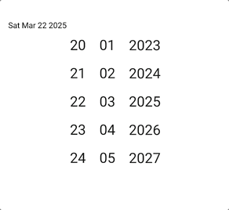
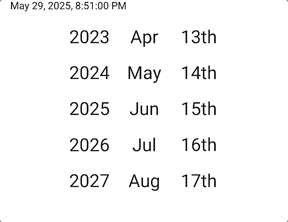
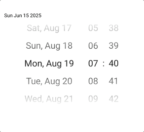
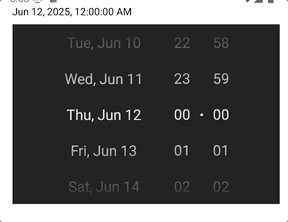
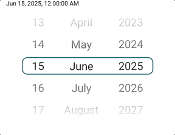

# React Native Date Time Picker - Spinner 📅 ⏰


[](https://www.npmjs.com/package/react-native-date-time-picker)

Lightweight, spinner-style picker for React Native and Expo. Supports **date** and **date-time** modes, custom formatting, min/max ranges, configurable column order, gradients, and custom separators.

Full Javascript, no linking required

Based on (and grateful to) [`react-native-timer-picker`](https://www.npmjs.com/package/react-native-timer-picker).

## Demos 📱

<p>
    
    
    
    
    
</p>

## Installation

React Native >= 0.72, React >= 18.2.

```bash
yarn add react-native-date-time-picker
# or
npm install react-native-date-time-picker
```

## Quick start (date)

<p></p>

```tsx
import React, { useState } from "react";
import { View, Text } from "react-native";
import { DateTimeSpinner } from "react-native-date-time-picker";

export default function Example() {
    const [value, setValue] = useState(new Date(2025, 5, 15));

    return (
        <View style={{ padding: 16 }}>
            <Text>{value.toDateString()}</Text>
            <DateTimeSpinner
                initialValue={value}
                minDate={new Date(2020, 0, 1)}
                maxDate={new Date(2030, 11, 31)}
                onDateChange={({ date }) => setValue(date)}
                padDayWithZero
                padMonthWithZero
            />
        </View>
    );
}
```

## Date-time mode (date + hour + minute) and gradient overlay

<p></p>

```tsx
import React, { useState } from "react";
import { View, Text } from "react-native";
import { DateTimeSpinner } from "react-native-date-time-picker";
import { format } from "date-fns";

export default function Example() {
    const [value, setValue] = useState(new Date(2025, 5, 15));

    return (
        <View style={{ padding: 16 }}>
            <Text>{value.toDateString()}</Text>

            <DateTimeSpinner
                mode="datetime"
                dateTimeOrder={["date", "hour", "minute"]}
                dateTimeSpacing={16}
                formatDateLabel={(date) => format(date, "eee, MMM d")}
                initialValue={new Date(2024, 7, 19, 7, 40)}
                minDate={new Date(2020, 0, 1)}
                maxDate={new Date(2030, 11, 31)}
                padHourWithZero
                padMinuteWithZero
                LinearGradient={LinearGradient}
                pickerGradientOverlayProps={{ locations: [0, 0.5, 0.5, 1] }}
                timeSeparator="·"
                onDateChange={({ date }) => setValue(date)}
            />
        </View>
    );
}
```

## Month/day/year swap with formatted labels

<p></p>

```tsx
import { format } from "date-fns";
import { LinearGradient } from "expo-linear-gradient";

<DateTimeSpinner
    columnOrder={["year", "month", "day"]}
    formatDateToParts={(date) => ({
        day: format(date, "do"),
        month: format(date, "MMM"),
        year: format(date, "''yy"),
    })}
    initialValue={new Date(2024, 7, 19)}
    onDateChange={({ date }) => setValue(date)}
/>;
```

## Example with selected line and non-infinite scrolling

<p></p>

```tsx
import React, { useState } from "react";

import { format } from "date-fns";
import { LinearGradient } from "expo-linear-gradient";
import { View, Text } from "react-native";
import { DateTimeSpinner } from "react-native-date-time-picker";

export default function Example() {
    const [value, setValue] = useState(new Date(2025, 5, 15));

    return (
        <View style={{ padding: 20 }}>
            <Text style={{ marginBottom: 8 }}>{format(value, "PPpp")}</Text>
            <View
                style={{
                    alignItems: "center",
                    justifyContent: "center",
                }}>
                <DateTimeSpinner
                    disableInfiniteScroll={true}
                    formatDateToParts={(date) => ({
                        day: format(date, "dd"),
                        month: format(date, "MMMM"),
                        year: format(date, "yyyy"),
                    })}
                    initialValue={value}
                    LinearGradient={LinearGradient}
                    onDateChange={({ date }) => setValue(date)}
                    pickerGradientOverlayProps={{
                        locations: [0, 0.5, 0.5, 1],
                    }}
                    repeatNumbersNTimes={1}
                />
                <View
                    accessible={false}
                    style={{
                        borderColor: "#1F5E73",
                        borderRadius: 12,
                        borderWidth: 2,
                        height: 40,
                        pointerEvents: "none",
                        position: "absolute",
                        width: 300,
                    }}></View>
            </View>
        </View>
    );
}
```

## Extended example (datetime with spacing, separator, gradient mask)

<p></p>

```tsx
import React, { useState } from "react";
import { View, Text } from "react-native";
import { DateTimeSpinner } from "react-native-date-time-picker";
import { format } from "date-fns";
import { LinearGradient } from "expo-linear-gradient";

export default function Example() {
    const [value, setValue] = useState(new Date(2025, 5, 15));

    return (
        <View style={{ padding: 20 }}>
            <Text style={{ marginBottom: 8 }}>{format(value, "PPpp")}</Text>
            <DateTimeSpinner
                mode="datetime"
                dateTimeOrder={["date", "hour", "minute"]}
                dateTimeSpacing={16}
                timeSeparator="·"
                padHourWithZero
                padMinuteWithZero
                LinearGradient={LinearGradient}
                pickerGradientOverlayProps={{
                    colors: [
                        "#232323",
                        "rgba(255,255,255,0)",
                        "rgba(255,255,255,0)",
                        "#232323",
                    ],
                    locations: [0, 0.4, 0.6, 1],
                }}
                formatDateLabel={(date) => format(date, "eee, MMM d")}
                minDate={new Date(2020, 0, 1)}
                maxDate={new Date(2030, 11, 31)}
                initialValue={value}
                onDateChange={({ date }) => setValue(date)}
                styles={{
                    theme: "dark",
                    pickerItem: { fontSize: 20 },
                    timeSeparatorText: { fontWeight: "700" },
                    dateTimeSpacer: { width: 20 },
                }}
            />
        </View>
    );
}
```

## Props

| Prop                         | Type                                                        | Default                    | Description                                                                    |
| ---------------------------- | ----------------------------------------------------------- | -------------------------- | ------------------------------------------------------------------------------ |
| `mode`                       | `"date" \| "datetime"`                                      | `"date"`                   | Select date-only or date + time columns.                                       |
| `initialValue`               | `Date` or partial `{ day, month, year, hour, minute }`      | today (clamped)            | Starting value. Clamped to `minDate`/`maxDate`.                                |
| `minDate`                    | `Date`                                                      | current year - 50 Jan 1    | Lower bound (inclusive).                                                       |
| `maxDate`                    | `Date`                                                      | current year + 50 Dec 31   | Upper bound (inclusive).                                                       |
| `onDateChange`               | `(value) => void`                                           | `undefined`                | Called with `{ date, day, month, year, hour, minute }` when selection changes. |
| `columnOrder`                | `Array<"day"\|"month"\|"year">`                             | `["day","month","year"]`   | Column order in `date` mode.                                                   |
| `dateTimeOrder`              | `Array<"date"\| "hour"\| "minute">`                         | `["date","hour","minute"]` | Column order in `datetime` mode.                                               |
| `dateTimeSpacing`            | `number`                                                    | `12`                       | Horizontal space between date and time columns (px) in `datetime` mode.        |
| `timeSeparator`              | `string`                                                    | `":"`                      | Separator text between hour and minute when both are present.                  |
| `formatDateToParts`          | `(date) => { day?: string; month?: string; year?: string }` | `undefined`                | Per-column formatter for date parts.                                           |
| `formatDateLabel`            | `(date) => string`                                          | `undefined`                | Formatter for the date column label in `datetime` mode.                        |
| `padDayWithZero`             | `boolean`                                                   | `true`                     | Left-pad day values to 2 chars.                                                |
| `padMonthWithZero`           | `boolean`                                                   | `true`                     | Left-pad month values to 2 chars.                                              |
| `padHourWithZero`            | `boolean`                                                   | `true`                     | Left-pad hour values to 2 chars.                                               |
| `padMinuteWithZero`          | `boolean`                                                   | `true`                     | Left-pad minute values to 2 chars.                                             |
| `padWithNItems`              | `number`                                                    | `1` (clamped 0–10)         | Buffer items above/below the selected row.                                     |
| `disableInfiniteScroll`      | `boolean`                                                   | `false`                    | If true, render finite lists (no looping).                                     |
| `repeatNumbersNTimes`        | `number`                                                    | `3` (min 2 in infinite)    | How many times to repeat values to allow recentring in infinite mode.          |
| `decelerationRate`           | `number \| "normal" \| "fast"`                              | `0.88`                     | Scroll deceleration rate passed to `FlatList`.                                 |
| `allowFontScaling`           | `boolean`                                                   | `false`                    | Pass through to `Text` for accessibility scaling.                              |
| `pickerFeedback`             | `() => Promise<void>`                                       | `undefined`                | Called on scroll end (hook for haptics/sounds).                                |
| `pickerGradientOverlayProps` | `Partial<LinearGradientProps>`                              | `undefined`                | Props forwarded to the gradient overlay.                                       |
| `LinearGradient`             | `any`                                                       | `undefined`                | Gradient component (e.g., from `expo-linear-gradient`).                        |
| `MaskedView`                 | `any`                                                       | `undefined`                | Mask component to apply gradient as a mask.                                    |
| `styles`                     | `CustomDateTimeSpinnerStyles`                               | `undefined`                | Style overrides (see below).                                                   |
| `pickerContainerProps`       | `View` props                                                | `undefined`                | Extra props for outer container.                                               |

## Styling

Provide `styles` to override typography, sizing, colors, and spacing. Defaults are derived from `src/components/TimerPicker/styles.ts`.

| Style key                                | Type                              | Default                                              | Notes                                                     |
| ---------------------------------------- | --------------------------------- | ---------------------------------------------------- | --------------------------------------------------------- |
| `theme`                                  | `"light" \| "dark"`               | `light`                                              | Switches base colors.                                     |
| `backgroundColor`                        | `string`                          | `#FFFFFF` (light) / `#232323` (dark)                 | Picker container background.                              |
| `pickerContainer`                        | `ViewStyle`                       | `{ flexDirection: "row", justifyContent: "center" }` | Outer container for all columns.                          |
| `pickerItemContainer`                    | `ViewStyle & { height?: number }` | `height: 50`, `paddingHorizontal: 12`, centered      | Row wrapper for each item.                                |
| `pickerItem`                             | `TextStyle`                       | `fontSize: 25`, themed color                         | Text style for each item.                                 |
| `pickerLabelContainer`                   | `ViewStyle`                       | Positioned right, min width auto                     | Holds optional label content.                             |
| `pickerLabel`                            | `TextStyle`                       | `fontSize: 18`, bold, themed color                   | Label text style.                                         |
| `durationScrollFlatList`                 | `ViewStyle`                       | `minWidth: 1`                                        | FlatList style override.                                  |
| `durationScrollFlatListContainer`        | `ViewStyle`                       | `overflow: "visible"`                                | Wrapper around FlatList.                                  |
| `durationScrollFlatListContentContainer` | `ViewStyle`                       | `{}`                                                 | Content container override.                               |
| `timeSeparatorContainer`                 | `ViewStyle`                       | centered                                             | Wrapper for the time separator.                           |
| `timeSeparatorText`                      | `TextStyle`                       | `fontSize: 24`, themed color                         | Separator text between hour and minute.                   |
| `dateTimeSpacer`                         | `ViewStyle`                       | `width: 12`                                          | Gap between date and time columns.                        |
| `pickerGradientOverlay`                  | `ViewStyle`                       | full overlay                                         | Used with `LinearGradient`/`MaskedView`.                  |
| `disabledPickerContainer`                | `ViewStyle`                       | `opacity: 0.4`                                       | Applied when picker disabled.                             |
| `disabledPickerItem`                     | `TextStyle`                       | `opacity: 0.2`                                       | Applied to disabled items.                                |
| `text`                                   | `TextStyle`                       | n/a                                                  | Base text override applied to labels/items when provided. |

## Behavior notes

-   Values are clamped to `minDate`/`maxDate`; days respect month length.
-   In `datetime` mode, the date column lists all days in range; hour/minute remain separate columns.
-   Inside a `ScrollView`, enable `nestedScrollEnabled` on the parent to quiet nested list warnings.

## Contributing / scripts

-   `yarn test` – run Jest
-   `yarn lint` – lint
-   `yarn build` – build with bob

## License

MIT
